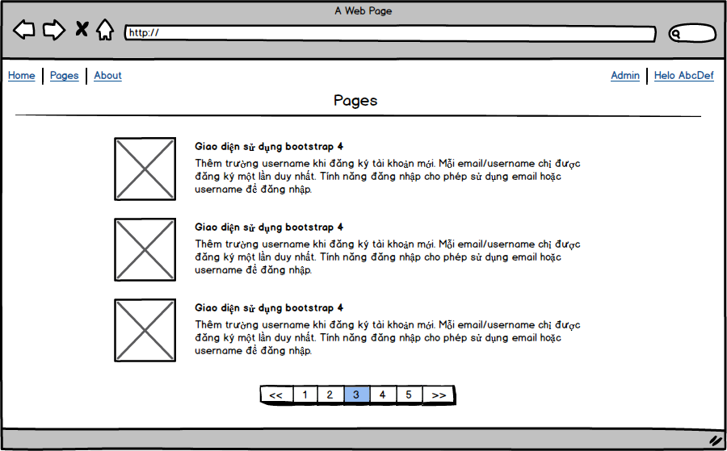
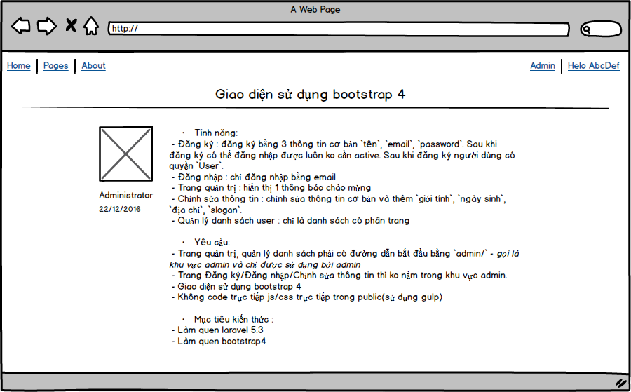

# Laravel Base

## Phiên bản

- [Laravel 5.3](https://laravel.com/docs/5.3)
- [Bootstrap v4](https://v4-alpha.getbootstrap.com)

## Mục tiêu

- Sử dụng được laravel 5.3 và hiểu được các tư tưởng quan trọng nhất trong laravel.
- Làm quen với Bootstrap 4 với các concept về html5/css3 rõ ràng hơn.
- Sử dụng các tooldev trong laravel ([composer](http://getcomposer.org), [gulp/elixir](https://laravel.com/docs/5.3/elixir), webpack, ...)

## Tổng quan

- Xây dựng 1 trang dạng CMS, bao gồm người dùng và blog là 2 phần chính
- Phần người dùng có phân quyền : `Registered`, `User`, `Admin`
 - `Admin` là người có tất cả quyền
 - `User` là người có thể đăng nhập và viết bài
 - `Registered` là người có thể xem một số bài giới hạn, có thể comment

- Phần blog là các bài viết của User, Admin. Tính năng comment được dùng cho toàn bộ người dùng đã đăng nhập.

## Chi tiết

### Level 1

- Tính năng:
 - Đăng ký : đăng ký bằng 3 thông tin cơ bản `tên`, `email`, `password`. Sau khi đăng ký có thể đăng nhập được luôn ko cần active. Sau khi đăng ký người dùng có quyền `User`.
 - Đăng nhập : chỉ đăng nhập bằng email
 - Trang quản trị : hiển thị 1 thông báo chào mừng
 - Chỉnh sửa thông tin : chỉnh sửa thông tin cơ bản và thêm `giới tính`, `ngày sinh`, `địa chỉ`, `slogan`.
 - Quản lý danh sách user : chỉ là danh sách có phân trang

- Yêu cầu:
 - Trang quản trị, quản lý danh sách phải có đường dẫn bắt đầu bằng `admin/` - _gọi là khu vực admin và chỉ được sử dụng bởi admin_
 - Trang Đăng ký/Đăng nhập/Chỉnh sửa thông tin thì ko nằm trong khu vực admin.
 - Giao diện sử dụng bootstrap 4
 - Không code trực tiếp js/css trực tiếp trong public(sử dụng gulp)

- Mục tiêu kiến thức :
 - Làm quen laravel 5.3
 - Làm quen bootstrap4
 - Cách phân chia ứng dụng thành 2 khu vực khác nhau tạm gọi là `admin`/`frontend`

### Level 2
_Tạo 1 branch có tên level1 từ master sau khi code xong `Level 1` sau đó thực hiện tiếp level 2 trên branch master_
- Tính năng:
 - Thêm username
 - Sửa thông tin user nâng cao
 - Xóa, khôi phục user
 - Page module
- Yêu cầu:
 - Thêm trường username khi đăng ký tài khoản mới. Mỗi email/username chỉ được đăng ký một lần duy nhất. Tính năng đăng nhập cho phép sử dụng email hoặc username để đăng nhập.
 - Sửa thông tin user: Thông tin user có thể được sửa bởi chính user hoặc admin, trang sửa bởi user thì ở phía frontent, không sửa được email, username. Trong quản trị, admin cũng có thể sửa thông tin user, ở đây sẽ có thể sửa email, username.
 - Xóa user: Trang danh sách user có thêm nút xóa, sau khi xóa, user này sẽ không hiển thị ở danh sách này mà ở 1 trang chứa danh sách các user đã bị xóa. Danh sách này có nút xóa vĩnh viễn và nút khôi phục tương ứng với mỗi user trên danh sách. Các user đã bị xóa sẽ không thể đăng nhập, nếu cố tình đăng nhập sẽ có bị đẩy ra trang chủ kèm thông báo tài khoản đã bị xóa. Email, username của người dùng đã bị xóa không thể sử dụng để đăng ký mới tài khoản.**(xem hướng dẫn sử dụng softdelete trong laravel)**
 - Page module gồm 2 phần, quản trị và frontend. Mỗi page có thông tin : tiêu đề, nội dung, ảnh đại diện, ngày tháng tạo/cập nhật. Content nhập dạng html(sử dụng tinyMCE). Ngoài frontend có trang danh sách và chi tiết với layout như sau:

 

 
 
 - Người dùng chưa đăng nhập cũng có thể xem trang danh sách và chi tiết page ngoài frontend.

